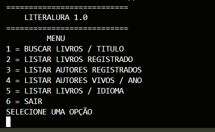
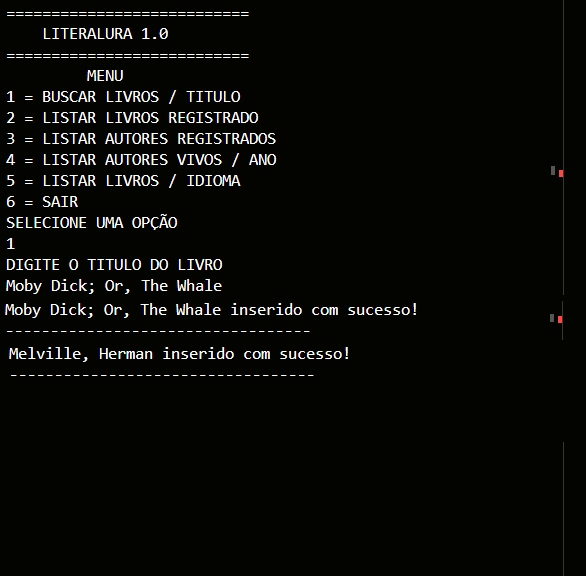
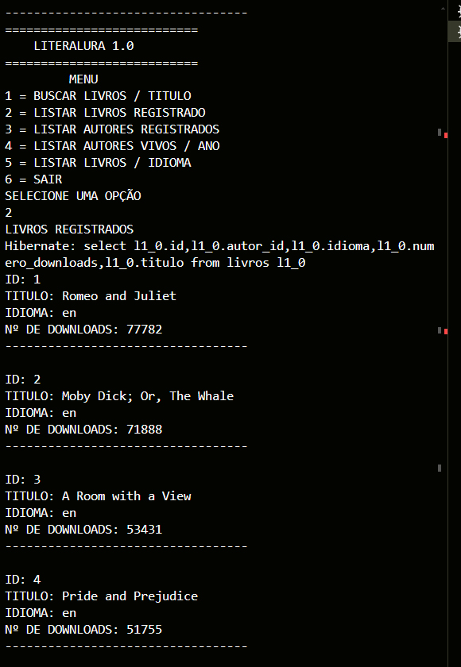
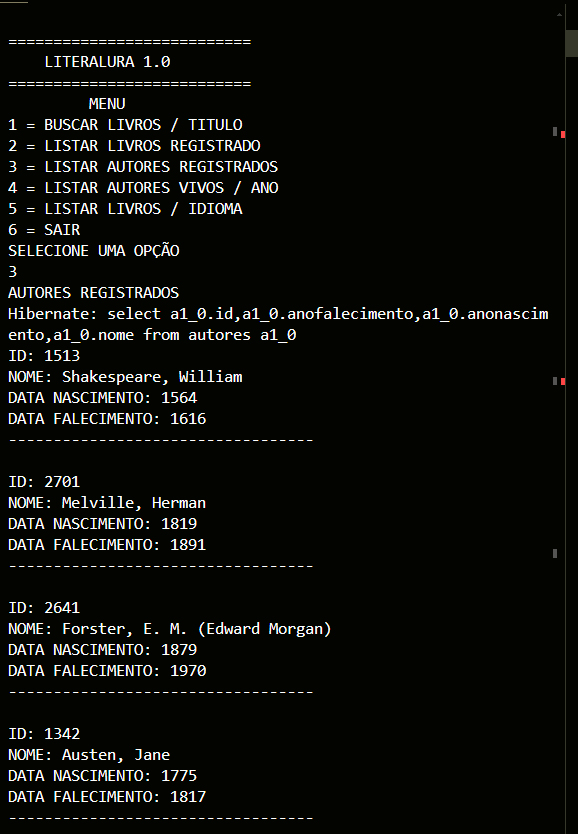
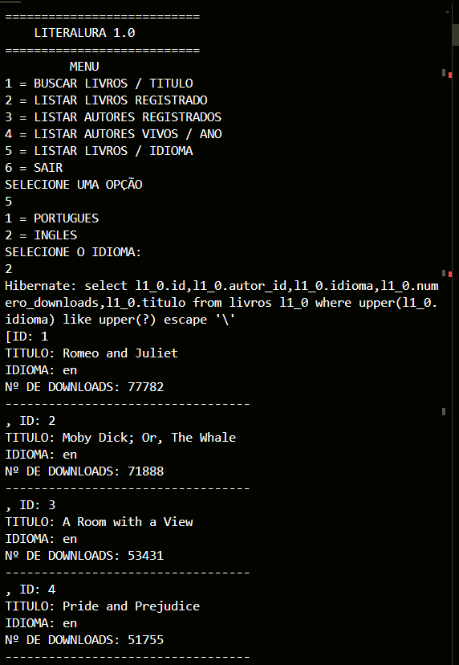

# ONE CHALLENGE - DESAFIO LITERALURA

* Neste emocionante desafio de programação, lhe convidamos a construir seu próprio catálogo de livros: o <b>LiterAlura</b>

## OBJETIVO

* Desenvolver um Catálogo de Livros que ofereça interação textual (via console) com os usuários, proporcionando no mínimo 5 opções de interação. Os livros serão buscados através de uma API específica. As informações sobre a API e as opções de interação com o usuário serão detalhadas na coluna “Backlog”/”Pronto para iniciar”.

## TELAS DO PROGRAMA

### MENU PRINCIPAL

### 1 - BUSCAR LIVROS - via api da <https://gutendex.com>
A API Gutendex é um catálogo com informações sobre os mais de 70 mil livros presentes no Project Gutenberg (biblioteca online gratuita).

Neste caso, realizamos a consulta pelo título do livro na API para reter o primeiro resultado obtido. Um livro deve ter os seguintes atributos:
Título;
Autor;
Idiomas;
Número de Downloads.

### 2 - LISTAR LIVROS REGISTRADOS
* Listar todos os livros inseridos no banco de dados do PostgreSQL.

### 3 - LISTAR AUTORES REGISTRADOS
* Listar todos os autores inseridos no banco de dados do PostgreSQL.

### 4 - LISTAR AUTORES VIVOS EM UM DETERMINADO ANO
* Agora que você avançou no uso do banco de dados, convidamos você a mudar o método para listar os autores vivos em um determinado ano. Para isso, você deve usar derived queries para recuperar todos os autores que estavam vivos no ano que o usuário fornecerá.

### 5 - LISTAR LIVROS POR IDIOMA
* Uma vez que você já tem livros e autores salvos em seu banco de dados, que tal exibir estatísticas sobre eles para o seu usuário? Aproveite os recursos de Streams do Java e derived queries para fornecer ao seu usuário estatísticas sobre a quantidade de livros em um determinado idioma no banco de dados.

* Não é necessário criar opções para todos os idiomas. Escolha no mínimo dois idiomas.

## 2 - TECNOLOGIAS / FERRAMENTAS / FRAMEWORKS
- spring boot
- java 21
- jpa
- PostgreSQL - Banco de dados Relacional
- API - gutendex.com
